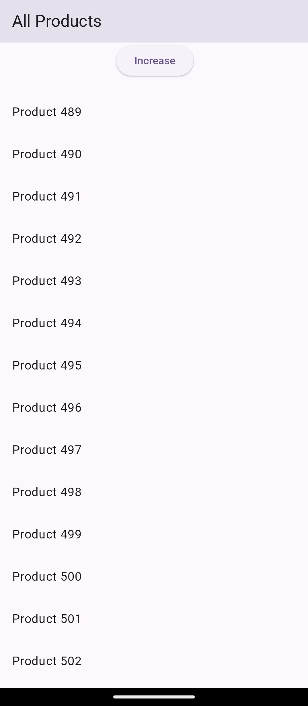
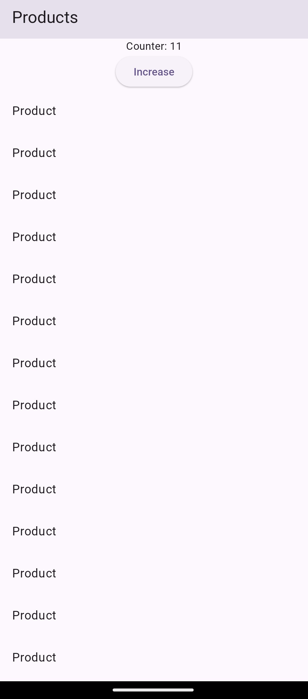

# Case 3: Performance Issue Due to Unnecessary Widget Rebuilds

## 🔴 Problem
The app experienced lag and jank while scrolling a large list.
Every state change caused the entire ListView to rebuild, resulting in poor performance on low-end devices.

## 🔍 Root Cause
A ValueListenableBuilder was wrapping the entire ListView.
This caused all list items to rebuild even though they were not dependent on the changing state.

## 🛠 Fix
Moved state listeners to only the widgets that needed updates.
The ListView was separated from reactive state, and const widgets were used where possible.

## ✅ Result
Scrolling became smooth and stable.
Unnecessary rebuilds were eliminated, significantly improving performance.

## 📸 Before

## 📸 After

