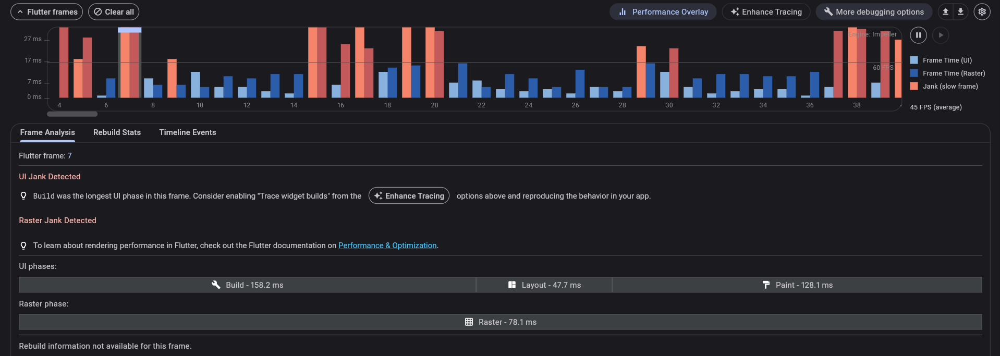
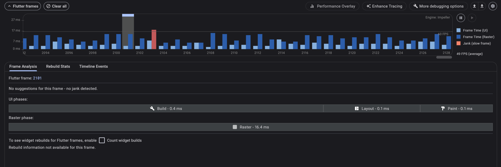

# Case 4: Performance Issue Due to Unoptimized Network Images

## 🔴 Problem
The app experienced scroll jank and high memory usage when displaying
a feed with many network images.
On low-end devices, the app could freeze or crash.

## 🔍 Root Cause
Full-resolution images were loaded without caching, resizing, or placeholders.
This caused excessive memory usage and image decoding work on the UI thread.

## 🛠 Fix
- Added image caching using CachedNetworkImage
- Resized images before rendering
- Added placeholders to avoid layout jumps
- Reduced memory pressure and decoding cost

## ✅ Result
Scrolling became smooth and stable.
Memory usage dropped significantly, and crashes were eliminated.

## 📸 Before

## 📸 After

