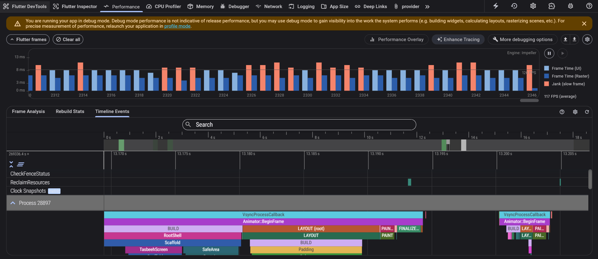
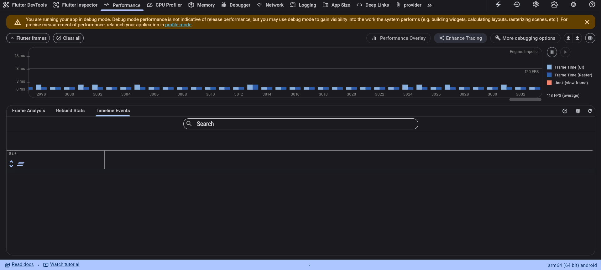

# Case 5: Performance Issue Due to Idle Rebuilds (Tasbeeh Screen)
## 🔴 Problem
The Tasbeeh screen kept producing frames even when the counter was paused.
This caused unnecessary CPU/GPU work and visible jank in DevTools.

## 🔍 Root Cause
A periodic Timer called setState() every second at the page level,
forcing the entire widget tree to rebuild even when nothing changed.

## 🛠 Fix
Removed the global timer from the screen
Rebuilt only the elapsed text widget
Started the timer only when the counter is running
Used context.select to limit rebuilds
## ✅ Result
Idle frames disappeared, DevTools timeline became stable,
and the screen stopped wasting resources.

## 📸 Before

## 📸 After

